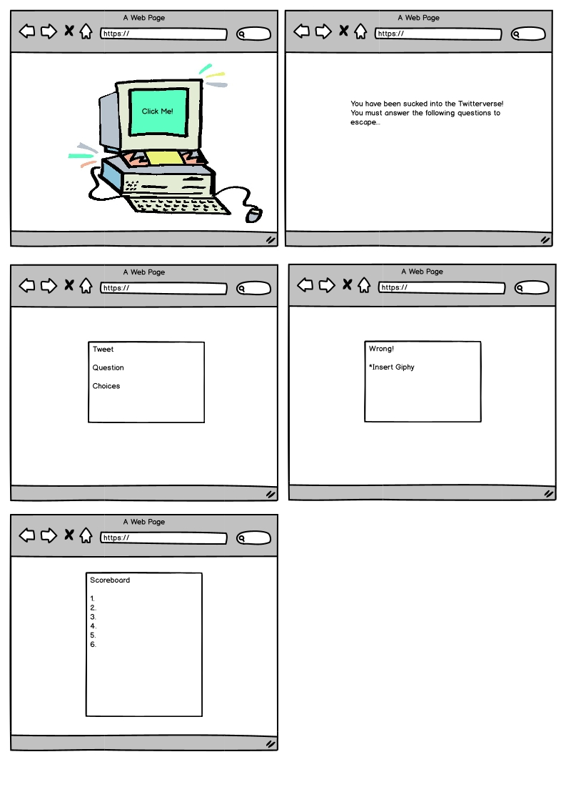

# ReadMe

https://moorejandy.github.io/Project-2/

Version 1.0

Deployment Date: February 8, 2020

## [Link to deployed app](https://stormy-atoll-88031.herokuapp.com/)

# Purpose

Upon clicking on the computer, you, the player will sucked into the Trump’s Twitterverse! Your challenge, should you choose to accept it, is to navigate through the multiple choice questions in order to escape. 

#  Instructions
1. Enter name a click START!
2. You have 30 seconds to read and answer the question associated with each tweet.

# Original Wireframe

# Original Contributors
Andy Moore: https://github.com/moorejandy

Samantha Gaiser: https://github.com/sambong

Brigid Woolery: https://github.com/bwoolery

# Future Development
- Incorporate other Twitter handles
- Allow users scores to be cumulative over time over time